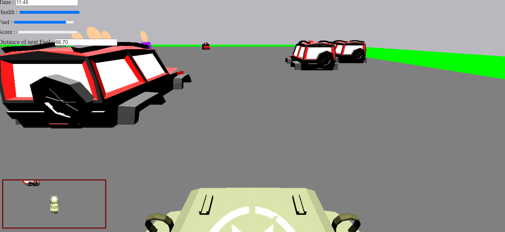
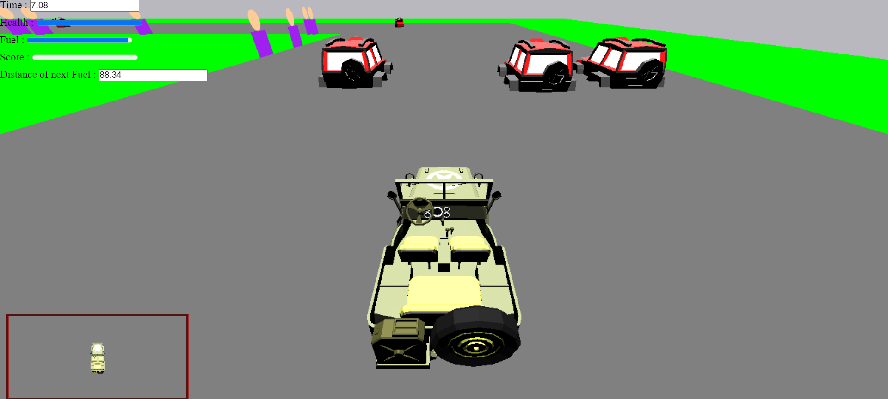

# Need-For-Speed


## Survive through the enemies on track filled with cars and win the race first

### To Play on windows :
```
npx webpack --config webpack.config.js
servez.cmd
```

### Features
#### Controls :
- <kbd>↑</kbd> : To Acclerate the car
- <kbd>↓</kbd>  : To Apply brakes
- <kbd>←</kbd> : To Turn car left
- <kbd>→</kbd> : To Turn car right

#### Camera : 
- <kbd>T</kbd> : To switch bw Third Person's view and Front view of Car

#### Scoring : 
- You get a **-10** on colliding with the enemy car 
- You get a **-5** for not running on track
- You get a **+10** on collecting a fuel can spreaded acorss track

#### Front View


#### Third Person's view


# Three.js with webpack Boilerplate

Install following

```
npm install three
npm install webpack
sudo npm -g install servez
```

To start the server in windows OS

```
npx webpack --config webpack.config.js
servez.cmd
``